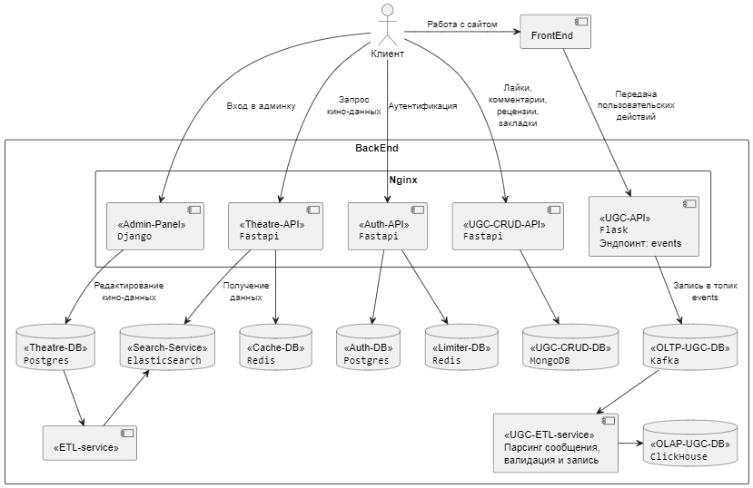

# Проектная работа 9 спринта

[Описание сервиса theatre_service](./theatre_service/README.md)

[Описание сервиса auth_service](./auth_service/README.md)

[Описание сервиса ugc_service](./ugc_service/README.md)

[Описание сервиса ugc_crud_service](./ugc_crud_service/README.md)

[Схема UGC таблиц](./clickhouse_tables.md)

[Исследование по выбору хранилища (clickhouse | vertica)](./storage_test/readme.md)

[Исследование по выбору хранилища (MongoDB | Postgres)](./storage_test_again/README.md)

## Схема взаимодействия сервисов

## Запуск сервиса

- Переменные среды для всех сервисов положить в файл *.env* по примеру файла *.env.sample*
- Запустить `docker compose up -d`
- При первом запуске настройте Sentry: получите `sentry_dsn` для каждого сервиса, впишите их в .env файл и перезапустите docker `docker-compose down` `docker compose up -d`
